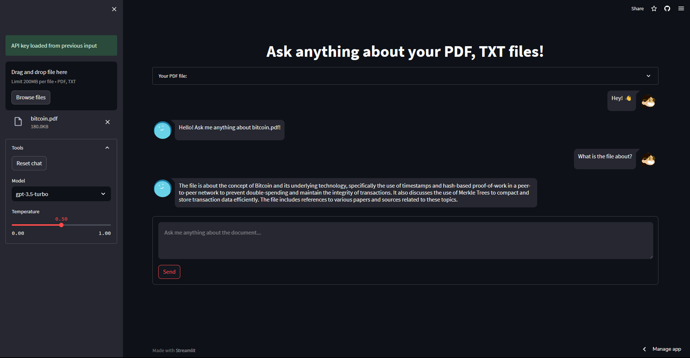

# 📄 Chat with the doc
Project using langchain and streamlit to do a web app that allows you to chat with a document or with your email with conversation memory. In this version the web app have a chat like UI with conversation memory.



## How to run it locally
Follow these steps to set up and run the service locally :

### Installation
Clone the repository :

`git clone https://github.com/FredericoBaker/chat-with-the-doc-v2`


Navigate to the project directory :

`cd chat-with-the-doc-v2`


Create a virtual environment :
```bash
python -m venv .venv
.\.venv\Scripts\activate
```

Install the requirements in the virtual environment :

`pip install -r requirements.txt`


Launch the project locally :

`python -m streamlit run src/home.py`
